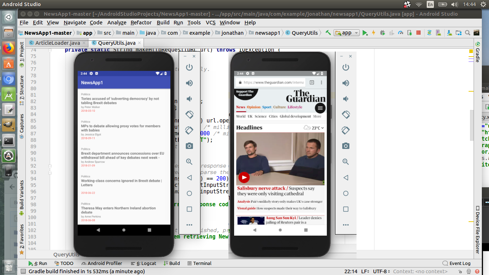

# NewsApp1
This is my submission for Udacity's NewsApp Project, Stage 1.
In it you will find various ideas and skills as taught in the course, they are:
 - Connecting to an API
 - Parsing a JSON response
 - Handling error cases gracefully
 - Updating information regularly
 - Using an AsynTask
 - Doing network operations independent of the Activity lifecycle
 
 
 
